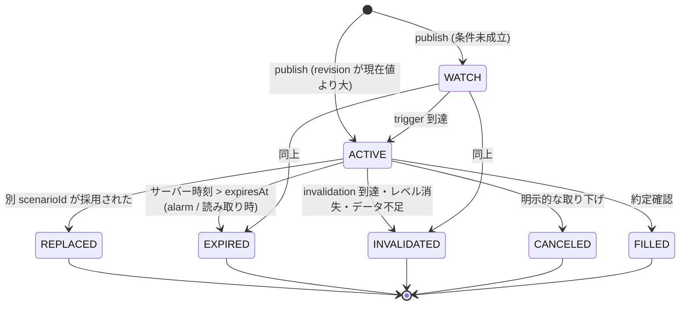
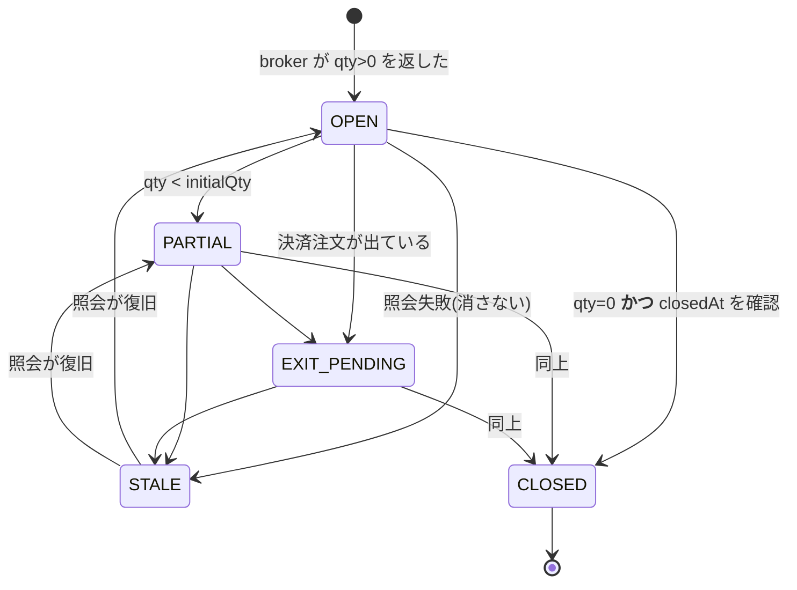

# NQX Nightwatch 状態サービス — 実装報告

Mini App の発注確認を **`CONFIRM & SEND ORDER` の一回押し**に統合し、
シナリオとポジションの正本を Cloudflare Durable Object に移した。

最終更新: 2026-08-13

---

## 1. 役割分担

```
┌─ ローカル PC ────────────────────────────────────────────┐
│  TradingView MCP → Claude Code → monitor_publish.py      │  producer
│  broker_status.py ──(読み取り専用)──→ Tradovate/CrossTrade │
│  telegram_bot.py ──(--confirm)──→ order.py → CrossTrade   │  唯一の発注主体
│         │                                                 │
│         └── nqx_state.py ──HMAC署名──┐                    │
└──────────────────────────────────────┼────────────────────┘
                                       ▼
                          ┌─ Cloudflare Worker ─────────┐
                          │  認証ゲートウェイのみ         │  発注経路なし
                          │  /api/state /api/ws          │
                          │  /api/publish /api/events    │
                          └──────────┬──────────────────┘
                                     ▼
                    ┌─ Durable Object (SQLite) ──────────┐
                    │  activeScenario と position の正本  │
                    │  Hibernatable WebSocket で差分 push │
                    │  alarm でシナリオ期限を自動失効     │
                    └──────────┬─────────────────────────┘
                               ▼ 読み取りのみ
                    ┌─ Cloudflare Pages ─────────────────┐
                    │  Mini App (静的フロント)            │
                    └──────────┬─────────────────────────┘
                               │ Telegram.WebApp.sendData
                               ▼
                    許可済み Bot → 全項目再検証 → order.py
```

**注文は Cloudflare を経由しない。** Worker と DO には CrossTrade / Tradovate /
order.py を呼ぶコードが 1 行も無く、テストで機械的に検査している
([tests/test_oneclick.py](tests/test_oneclick.py) セクション1)。

---

## 2. 状態スキーマ

Durable Object が保持する doc(`state_doc` テーブル、1 行)。

```jsonc
{
  "version": 1,
  "accountId": "lucid-50k-daily",
  "symbol": "MNQU6",
  "seq": 42,                                  // 全体の更新通番(WS の順序判定用)
  "revisions": {                              // stream ごとに独立。互いを上書きしない
    "scenario": 1786612192000,
    "position": 1786612201000,
    "order":    1786612199000,
    "market":   1786612205000
  },
  "scenario": {
    "scenarioId": "fp_ab12…@2026-08-13T03:10:14+00:00",
    "fingerprint": "fp_ab12…",                // 価格・方向・銘柄から決まる安定キー
    "state": "ACTIVE",                        // ACTIVE | ARMED | WATCH
    "symbol": "MNQU6",
    "side": "BUY",
    "qty": 1,
    "entry": 29906.50, "stop": 29871.50, "target": 29922.75,   // 全て 0.25 tick 正規化済み
    "riskDollars": 70.0, "rr": 0.464,
    "title": "…", "reason": "…", "trigger": "…", "invalidation": "…",
    "issuedAt": "…", "observedAt": "…", "expiresAt": "…", "snapshotAt": "…",
    "revision": 1786612192000
  },
  "order": {
    "idempotencyKey": "5e452129ffcbe0f933b9c1a1e64b2a58",
    "scenarioId": "…",
    "state": "PENDING",                       // PENDING|SENT|REJECTED|UNKNOWN|FILLED|CANCELED
    "side": "BUY", "qty": 1,
    "entry": 29906.50, "stop": 29871.50, "target": 29922.75,
    "receipt": "HTTP 200", "detail": "…", "at": "…"
  },
  "position": {
    "state": "OPEN",                          // OPEN|PARTIAL|EXIT_PENDING|STALE|CLOSED
    "verified": true,
    "source": "tradovate-rest",
    "symbol": "MNQU6", "side": "LONG",
    "qty": 2, "initialQty": 2,
    "avgEntry": 29906.50, "stop": 29871.50, "target": 29922.75,
    "currentPrice": 29918.50, "unrealizedPnl": 48.0,
    "receipt": "…", "filledAt": "…", "observedAt": "…",
    "staleSince": null, "lastKnownState": null,   // STALE のときだけ埋まる
    "closedAt": null, "closedQty": null            // CLOSED のときだけ埋まる
  },
  "market": { "at": "…", "price": …, "vwap": …, "cvd": …, "regime": "…", "bars": […], "levels": […] },
  "result": {                                 // 決済結果(履歴。現在の状態ではない)
    "resultId": "rs_9f2c…",
    "side": "LONG", "symbol": "MNQU6", "qty": 2,
    "entry": 29760.00, "exit": 29796.00, "stop": 29726.00, "pointValue": 2,
    "openedAt": "…", "closedAt": "…",
    "path": [29760.00, 29768.25, …],          // 実観測のみ
    "pathSource": "observed-bars",            // observed-bars | endpoints-only
    "pathPoints": 9,
    "exitSource": "broker",                   // broker | manual
    "verdict": "They let this one through.",
    "mode": "SIMULATION", "receipt": "HTTP 200"
  },
  "lastVerifiedAt": "2026-08-13T03:11:14Z"    // ブローカー照会が成功した最後の時刻
}
```

`result` には **state / pnl / realisedR / held / usd を入れない。** 表示層が同じ
元データから導出する契約なので、外から渡すと表示と内部が乖離する。これらの
キーが混ざった payload は Durable Object が拒否する。

`/api/state` と WebSocket が返すのは、これを `projectState()` に通した
**投影**で、以下が付く。

```jsonc
{
  "serverTime": "…",                       // 期限判定はこの時刻で行う
  "closedPosition": { … },                 // CLOSED になった建玉(カードは閉じる)
  "display": {
    "priority": "POSITION_OPEN",           // POSITION_OPEN|POSITION_EXIT|ORDER_PENDING|SCENARIO_ACTIVE|SCENARIO_NONE
    "orderable": false,
    "blockReason": "POSITION OPEN — MANAGEMENT ONLY"
  }
}
```

### その他のテーブル

| テーブル | 用途 |
|---|---|
| `events` | 受理/拒否/期限切れを区別した監査ログ(直近 500 件) |
| `consumed_nonces` | 消費済み nonce(24 時間保持)。重複 event を弾く |
| `order_intents` | 予約。ブラウザからの発注入口は無い |

---

## 3. API 仕様

すべて `Cache-Control: no-store`。

| メソッド | パス | 認証 | 用途 |
|---|---|---|---|
| GET | `/api/health` | なし | 死活確認 |
| GET | `/api/state` | Telegram initData **または** launch token | 完全 snapshot |
| GET | `/api/ws` (Upgrade) | launch token(`Sec-WebSocket-Protocol`) | snapshot + 差分 push |
| POST | `/api/publish` | HMAC 署名(PC のみ) | 状態更新 |
| GET | `/api/events` | HMAC 署名(PC のみ) | 監査ログ |

**発注エンドポイントは存在しない。** `/api/order` `/api/confirm` `/api/send`
`/api/execute` はすべて 404 を返すことをテストしている。

### 読み取り認証について(仕様上の制約)

Telegram は **keyboard button で起動した Mini App に initData を渡さない**。
そして `sendData`(= Bot への発注経路)が使えるのは keyboard button 起動だけ。
つまり「initData 検証」と「sendData で発注」は同時に成立しない。

対応として両方を実装した。

- **initData がある場合**(inline button / menu button / direct link 起動)
  → `X-Telegram-Init-Data` ヘッダーを Telegram の HMAC 方式で検証し、
  `auth_date` の鮮度と許可 user id を確認する。
- **initData が無い場合**(keyboard button 起動)
  → Bot が発行する **launch token** を検証する。
  形式 `v1.<userId>.<exp>.<HMAC-SHA256>`、既定 6 時間で失効。
  Bot だけが持つ `NQX_LAUNCH_SECRET` で署名されており、user id が
  署名対象に入っているのですり替えられない。

どちらで通っても、`NQX_ALLOWED_USER_ID` と一致しなければ 403。
WebSocket はブラウザが独自ヘッダーを送れないため launch token のみ
(`Sec-WebSocket-Protocol: nqx.v1, nqx-token.<token>`)。

### PC → Worker の署名

```
X-NQX-Timestamp: <unix秒>          ±120 秒を超えたら拒否
X-NQX-Nonce:     <16〜128文字>      DO 側で一回限りとして消費(24時間保持)
X-NQX-Account:   <accountId>
X-NQX-Signature: HMAC-SHA256(NQX_PUBLISH_SECRET,
                   "v1:<timestamp>:<nonce>:<accountId>:<sha256hex(body)>")
```

body には `stream` / `revision` / `nonce` / `payload` が入る。
**revision が現在値以下なら 409。** 順不同・再送・巻き戻しはここで落ちる。

`state 更新` `event 記録` `nonce 消費` は `ctx.storage.transactionSync()` で
**同一トランザクション**に入れてある。片方だけ成立することはない。

---

## 4. 状態遷移

### シナリオ



終端状態に入ったシナリオは表示対象から外れ、**二度と復活しない**
(古い revision の再送は 409、キャッシュも過去 JSON も参照しない)。

### ポジション



**注文送信だけでは OPEN にならない。** `order` stream は position を
一切触らず、`scenario` stream も position を触らない
(混ぜたイベントは構造的に拒否される)。

`qty=0` でも `closedAt` が無ければ **409 で拒否** し、カードは残る。

### 決済結果 (`result`)

終端状態を持たない独立ストリーム。**現在の状態ではなく履歴**なので
`display.priority` に影響せず、`position` / `scenario` / `order` を書き換えない
(混ざった payload は構造的に拒否)。

出所を必ず持つ。ここに無い値は受け付けない。

| 項目 | 許される値 | 意味 |
|---|---|---|
| `exitSource` | `broker` | ブローカーの往復(`boughtValue/bought`・`soldValue/sold`)から出した平均決済価格 |
| | `manual` | ユーザーが `/result <価格>` で明示した価格 |
| `pathSource` | `observed-bars` | publish 済みの実バー(TradingView 3分足)の終値を保有区間で切り出したもの |
| | `endpoints-only` | 区間内に観測が無かった。両端 2 点だけ。**値動きを作らない** |

**相場から推定した決済価格は存在しない。** 取得できなければ結果を publish せず、
Bot が `/result 29796.25` を促す。

`verdict` は state(win/loss/flat)× 出方(target/stop/manual)のテーブルから
`resultId` のハッシュで決定的に引く。同じトレードなら常に同じ文言、別の
トレードなら変わる。判定材料は実価格のみ。

### 表示優先順位

```
OPEN / PARTIAL / STALE POSITION   ← 常に最上部に固定
  → EXIT PENDING
  → ORDER PENDING
  → ACTIVE SCENARIO
  → NO ACTIVE SCENARIO
  → (末尾) CLOSED RESULT           ← 履歴。現在の状態を押しのけない
```

ポジションがある間、`display.orderable` は必ず `false`
(`POSITION OPEN — MANAGEMENT ONLY`)。Bot 側も独立に同じ判定を行う。

---

## 5. 発注フロー(一回押し)

```
Mini App: CONFIRM & SEND ORDER を押す
  ├ 押下と同時に disabled + "SENDING..."          ← 二重タップはここで止まる
  ├ clientNonce を新規生成(128bit)
  └ Telegram.WebApp.sendData(payload)
        ↓ Telegram
Bot: web_app_data 受信
  ├ 1. 許可 chat_id と完全一致か                   (不一致は無応答)
  ├ 2. clientNonce の長さ・シナリオ期限・fingerprint
  ├ 3. symbol / side / 0.25 tick 正規化
  ├ 4. 正規化「後」の値で方向を再判定
  ├ 5. qty ≤ 2 / リスク ≤ $200
  ├ 6. ブローカー建玉照会(建玉ありなら拒否)
  ├ 7. order.py --status で日次回数
  ├ 8. idempotency key を消費(ファイル永続)       ← 再送・再起動後も一回限り
  ├ 9. order.py ドライラン(--confirm なし)
  ├10. NQX_LIVE_ORDERS=1 か                        (無ければ LIVE ROUTE LOCKED)
  ├11. order.py --confirm を **一度だけ**
  └12. 送信結果を分類して返す
```

### 送信結果の分類

| 判定 | 条件 | 表示 |
|---|---|---|
| `SENT` | 終了コード 0 かつ `HTTP 2xx` 行がある | `ORDER SENT` + receipt |
| `REJECTED` | `HTTP ERROR` / `ERROR:` がある | `ORDER BLOCKED` |
| `UNKNOWN` | どちらも判定できない(タイムアウト等) | `UNKNOWN — VERIFY BROKER` |

**ドライラン成功を約定成功として表示しない。** `ORDER SENT` は
「CrossTrade が 2xx を返した」までしか主張せず、約定はブローカー照会で
別途確認される旨を必ず併記する。

---

## 6. 変更・追加ファイル

### 新規

| ファイル | 内容 |
|---|---|
| [cloudflare/src/state_machine.js](cloudflare/src/state_machine.js) | 状態スキーマと遷移(純粋関数・ランタイム非依存) |
| [cloudflare/src/nightwatch_do.js](cloudflare/src/nightwatch_do.js) | SQLite-backed Durable Object + Hibernatable WebSocket + alarm |
| [cloudflare/src/auth.js](cloudflare/src/auth.js) | initData 検証 / launch token / publish 署名 |
| [cloudflare/src/index.js](cloudflare/src/index.js) | Worker ルーティング(発注経路なし) |
| [cloudflare/wrangler.toml](cloudflare/wrangler.toml) | DO バインディングと SQLite migration |
| [cloudflare/test/state_machine.test.mjs](cloudflare/test/state_machine.test.mjs) | 遷移の単体テスト 21 件 |
| [cloudflare/test/auth.test.mjs](cloudflare/test/auth.test.mjs) | 認証・署名の単体テスト 14 件 |
| [cloudflare/test/integration.test.mjs](cloudflare/test/integration.test.mjs) | 本物の workerd に対する結合テスト 16 件 |
| [cloudflare/test/dev_seed.mjs](cloudflare/test/dev_seed.mjs) | ローカル確認用シード |
| [broker_status.py](broker_status.py) | ブローカー建玉照会アダプタ(読み取り専用・fail-closed) |
| [nqx_state.py](nqx_state.py) | PC → Worker の署名付き publisher |
| [telegram_mini_app/state_client.js](telegram_mini_app/state_client.js) | /api/state + WebSocket クライアント |
| [telegram_mini_app/result.js](telegram_mini_app/result.js) | 決済結果の表示層(原本の描画コードを移植) |
| [telegram_mini_app/result.css](telegram_mini_app/result.css) | 同上のスタイル。`#resultView` にスコープ |
| [telegram_mini_app/dev-telegram.html](telegram_mini_app/dev-telegram.html) | Telegram ランタイムのブラウザ検証ハーネス(配布物に入らない) |
| [tests/test_oneclick.py](tests/test_oneclick.py) | 一回押し発注の検証 45 件 |
| [tests/test_state_bridge.py](tests/test_state_bridge.py) | Python ↔ JS のスキーマ・署名整合 26 件 |
| `.secrets/nqx_cloud.env.example` / `.secrets/tradovate.env.example` | 設定テンプレート |

### 変更

| ファイル | 変更点 |
|---|---|
| [telegram_bot.py](telegram_bot.py) | `scenario_order_confirmed` 専用経路、idempotency 永続化、建玉 preflight、送信結果分類、`/sync`、`/result`、決済検知、launch token 付き Mini App URL、定期建玉照会 |
| [nqx_state.py](nqx_state.py) | `build_path` / `build_result` / `publish_result`、verdict テーブル、コスト帯判定 |
| [broker_status.py](broker_status.py) | `realised_prices` — ブローカーの往復から平均建値・平均決済値を出す |
| [cloudflare/src/state_machine.js](cloudflare/src/state_machine.js) | `result` ストリームの検証と遷移を追加 |
| [order.py](order.py) | **送信失敗時に終了コード 1 を返す**(以前は下流が 500 でも exit 0 で、呼び出し側が成功と誤表示できた)。承認ゲートは一切緩めていない |
| [monitor_publish.py](monitor_publish.py) | ライフサイクル項目付きで publish。表示は 1 件だけにし、落としたシナリオを報告。publish 失敗時は「未検証プレビュー」に退避 |
| [telegram_mini_app/app.js](telegram_mini_app/app.js) | 全面書き換え。サーバー状態から描画、一回押し発注、決済結果への導線 |
| [telegram_mini_app/index.html](telegram_mini_app/index.html) | 静的シナリオ行を撤去し `#stateStack` に置換、`#verifyLine` と `#resultView` 追加、Archivo を追加 |
| [telegram_mini_app/chart.js](telegram_mini_app/chart.js) | `autoPoll` オプション追加(静的 market.json がライブ値を上書きしないように)。**既存バグ修正**: 最終足ドットの `cx="NaN"` |
| [telegram_mini_app/styles.css](telegram_mini_app/styles.css) | state stack 用のスタイルを追記(既存セレクタは温存) |
| `.claude/launch.json` | Mini App の dev サーバー定義 |

`buildTruthChart`(`project/app/nq-nightwatch-nqx-final.html`)、NQX 検証ロジック、
`monitor_publish.py` の Telegram 配信契約と重複防止、`order.py` の安全装置は
いずれも削除・置換していない。

---

## 7. テスト結果

実注文・CrossTrade 送信・Tradovate 送信は **1 回も実行していない**。

| スイート | 件数 | 結果 | 実行方法 |
|---|---|---|---|
| 状態遷移(JS 単体) | 47 | **全通過** | `cd cloudflare && node --test test/state_machine.test.mjs` |
| 認証・署名(JS 単体) | 14 | **全通過** | `cd cloudflare && node --test test/auth.test.mjs` |
| Worker + DO + WS(結合) | 18 | **全通過** | `cd cloudflare && node --test --test-timeout=180000 test/integration.test.mjs` |
| 一回押し発注・決済結果(Python) | 79 | **全通過** | `python tests/test_oneclick.py` |
| Python ↔ JS 整合 | 75 | **全通過** | `python tests/test_state_bridge.py` |
| **合計** | **233** | **全通過** | |

件数は 2026-08-16 の実測(Worker 側 47+14+18 = **79** が HANDOFF §11 の
「Worker 79/79」に対応。Python 側は同日の §11 ② 対処と成行 --last 対応で
増加済みの値)。機能追加のたびに増えるので、この表より実行結果を正とする。

### 指示された必須テストの対応

| 要求 | 対応 |
|---|---|
| 古い payload / 順不同 revision / 重複 nonce で scenario が復活しない | state_machine 「順不同 revision は拒否され…」、integration 「同じ nonce の再送は 409」「古い revision の scenario は拒否され」 |
| scenario が期限到達後に消える | state_machine 「期限到達後、サーバー時刻だけで…」、integration 「producer の追加送信なしで…」、ブラウザ実測(24 秒 TTL: t=10s 表示 → t=26s 消失) |
| Bot 停止中も古い scenario を active 表示しない | state_machine 「Bot 停止中に期限が来ても…」 |
| WebSocket 切断・再接続後に最新 snapshot へ収束 | integration 「切断中の更新を挟んでも…」(切断中 3 回更新 → 再接続で最新値に一致) |
| 約定 position が再読込・Bot 再起動後も復元 | state_machine 「約定 position は保存され…」、integration 「約定 position は publish 後も保持され…」 |
| status 照会失敗時に position が STALE で残る | state_machine 「照会失敗では position を消さず…」、integration 同、ブラウザ実測 |
| 部分決済後に残数量が更新される | state_machine / integration 「部分決済で残数量が更新される」、ブラウザ実測(`QTY 1 / 2`) |
| broker の qty=0 確認前に position が消えない | state_machine / integration 「qty=0 でも closedAt が無ければ…」(409) |
| 新 scenario が open position を上書きしない | state_machine 「新しい scenario が open position を上書きしない」+「scenario イベントに position を混ぜたら拒否」、integration 同 |
| 二重タップ・Telegram 再送で注文が一回しか実行されない | test_oneclick 「二重タップでも --confirm は 1 回だけ」「Bot 再起動後でも同じ nonce は拒否」、ブラウザ実測(三連タップ → sendData 1 回) |
| 実注文を行わず mock と dry-run で完了 | 全スイートで `--confirm` はスタブ。ドライランは `order.py` の一時コピーに対して実行(実 `order_log.json` に触れない) |

### ブラウザでの実測(`wrangler dev` + `vite dev`)

| 確認項目 | 結果 |
|---|---|
| 初回 `/api/state` → WebSocket 昇格 | `LIVE` / `LAST VERIFIED 08/13 12:09:52 JST` |
| ポジション最上部固定 | カード順 `position` → `scenario` |
| STALE 表示 | `STALE — POSITION NOT VERIFIED`、qty 2 保持、赤系スタイル適用 |
| 部分決済 | `LONG 1 PARTIAL` / `QTY 1 / 2` |
| 保有中の新規発注ブロック | `POSITION OPEN — MANAGEMENT ONLY` |
| シナリオ期限 | 24 秒 TTL で t=10s 表示 → t=26s に `NO ACTIVE SCENARIO` |
| 三連タップ | `sendData` 1 回、ボタン `SENT — AWAITING BOT` / disabled |
| payload → Bot | ブラウザが出した payload をそのまま Bot に通し、`--confirm` 1 回・argv 正規化済みを確認 |
| 通常ブラウザ | `BROWSER / NO ORDER ROUTE`、発注ボタンなし |
| api/token 無しで起動 | `NO STATE SERVICE` + `NO ACTIVE SCENARIO`(古い内容を出さない) |
| コンソールエラー | 0 件(chart.js の `cx=NaN` 修正後) |
| 横スクロール | なし(375×812) |
| **決済結果 WIN** | ピル `+$144.00`(`#C6F038`)/ `FILED` / `1.06 R` / `14m 00s` |
| **決済結果 LOSS** | ピル `−$136.00`(`#FF2E4C`)/ `REDACTED` / `−1.00 R` |
| **決済結果 FLAT** | ピル `+$2.00`(`#8C93A0`)/ `NO ACTION` / glow `.18`(+0.50pt はコスト帯内) |
| 結果の自動表示 | 新しい `resultId` で一度だけ自動で開き、再描画・再接続では開き直さない |
| CLOSE → 再表示 | コンソールに戻り、末尾の RESULT カードから再度開ける |
| Type 1 / Type 2 | Type 1 は静止、Type 2 はフレームが更新される。非表示中はループ停止 |
| SAVE CARD | 1080×1350 の PNG(約 1.0MB)。シート表示中はアニメーション停止 |
| `endpoints-only` | `PATH: ENDPOINTS ONLY` を画面に出したまま表示する |
| CSS 変数の分離 | `:root` の `--bone` は `#bdb7a8`(コンソール側)のまま。結果画面の値は漏れない |
| ビルド成果物 | `dist/` に `dev-telegram.html` も `demoPath` も入らない |

スクリーンショットはこのセッションでブラウザペインが表示されていないため
取得できていない(`Browser pane is not displayed`)。上記はすべて DOM の
実測値による確認。

---

## 8. Cloudflare 設定手順

### 8.1 Worker + Durable Object

```bash
cd cloudflare
npm install
npx wrangler login
```

`wrangler.toml` の `[vars]` を埋める(秘密でも個人識別子でもない値だけ)。

```toml
NQX_ACCOUNT_ID = "lucid-50k-daily"
NQX_SYMBOL = "MNQU6"
NQX_ALLOWED_ORIGIN = "https://nqx-nightwatch.pages.dev"
```

秘密と識別子を投入する(`wrangler.toml` には書かない)。`NQX_ALLOWED_USER_ID`(Telegram の数値
user id)と `NQX_AUTOTRADE_ACCOUNTS`(CrossTrade 口座 ID の CSV。ローカル `CROSSTRADE_ACCOUNTS` と
**必ず同じ集合**)は 2026-09-15 に `[vars]` から secret へ移した。Worker のコードは `env.<名前>` で読むだけ
なので var と secret のどちらでも動く。`python setup_cloudflare.py --sync-secrets` が
`.secrets/telegram.env` と `.secrets/crosstrade.env` から 2 つを投入する。

```bash
npx wrangler secret put TELEGRAM_BOT_TOKEN
npx wrangler secret put NQX_PUBLISH_SECRET
npx wrangler secret put NQX_LAUNCH_SECRET
npx wrangler secret put NQX_ALLOWED_USER_ID
npx wrangler secret put NQX_AUTOTRADE_ACCOUNTS
```

ローカルの `wrangler dev` 用の値は `cloudflare/.dev.vars`(git 管理外)に置く。
口座を入れ替えたときは `crosstrade.env` を直してから `--sync-secrets` を叩く(deploy は不要。
secret の投入だけで新しい version が出る)。

`NQX_PUBLISH_SECRET` と `NQX_LAUNCH_SECRET` は別々の値にする。生成例:

```bash
python -c "import secrets; print(secrets.token_hex(32))"
```

デプロイ。

```bash
npx wrangler deploy
```

`[[migrations]] new_sqlite_classes` により SQLite-backed DO として作られる。
表示された Worker の URL を控える。

### 8.2 PC 側

```bash
cp .secrets/nqx_cloud.env.example .secrets/nqx_cloud.env
```

`NQX_API_BASE` に Worker の URL、`NQX_PUBLISH_SECRET` / `NQX_LAUNCH_SECRET` に
8.1 と同じ値を入れる。

```bash
python nqx_state.py --check
```

### 8.3 Mini App(Pages)

```bash
cd telegram_mini_app
npm install
npm run build
```

`dist/` を Cloudflare Pages にアップロードする。
`NQX_ALLOWED_ORIGIN` は Pages の URL と完全一致させる(末尾スラッシュなし)。

### 8.4 ブローカー照会(任意・推奨)

```bash
cp .secrets/tradovate.env.example .secrets/tradovate.env
python broker_status.py --check
```

未設定でも動くが、その場合ポジションは常に
`STALE — POSITION NOT VERIFIED` になり、**約定の確認ができない**。

### 8.5 ライブ発注の解除

`.secrets/telegram.env` に以下を入れて Bot を再起動する。

```
NQX_LIVE_ORDERS=1
```

これが無い限り、ボタンを押しても `LIVE ROUTE LOCKED` を返して送信しない。

### 8.6 ローカル確認

```bash
cd cloudflare
node node_modules/wrangler/bin/wrangler.js dev --port 8799 --ip 127.0.0.1 \
  --var NQX_ALLOWED_USER_ID:4242 --var NQX_ACCOUNT_ID:lucid-50k-daily \
  --var NQX_SYMBOL:MNQU6 --var "NQX_ALLOWED_ORIGIN:http://localhost:8765" \
  --var NQX_PUBLISH_SECRET:integration-publish-secret \
  --var NQX_LAUNCH_SECRET:integration-launch-secret \
  --var TELEGRAM_BOT_TOKEN:000:DEV-ONLY
```

```bash
node test/dev_seed.mjs position
```

出力された URL を `npm run dev` した Mini App で開く。
`dev-telegram.html` を使うと Telegram ランタイムを模擬して発注ボタンまで確認できる
(`sendData` は `window.__sentData` に貯まるだけで外部に出ない)。

---

## 9. 未実施・既知の制約

### 実注文テストは未実施

指示どおり、実際の `order.py --confirm` / CrossTrade 送信 / Tradovate 送信は
一切行っていない。実ルートの確認には次が必要:

1. `.secrets/nqx_cloud.env` と Worker の secret を実際に設定する
2. `.secrets/tradovate.env` を設定し `python broker_status.py --check` で疎通確認
3. `NQX_LIVE_ORDERS=1` を設定して Bot を再起動
4. **最小サイズ(1 枚)で 1 回だけ**送信し、Tradovate 側の建玉と
   Mini App のポジションカードが一致することを確認

### Tradovate REST は未検証

[broker_status.py](broker_status.py) の `TradovateAdapter` は
`/auth/accesstokenrequest` → `/account/list` → `/contract/find` → `/position/list`
の順で照会する実装だが、**実際の API に対しては未検証**。
認証情報が無い環境では自動的に無効になり、`verified=False` を返す。

CrossTrade は本来一方向の webhook 中継で、既定では照会経路を持たない。
`CROSSTRADE_POSITION_URL` を設定した場合のみ第 2 候補として使う。

### 既存テストの失敗は事前から

[tests/test_bot.py](tests/test_bot.py) と [tests/test_buttons.py](tests/test_buttons.py) は
実 `.secrets/order_log.json` を読む `order.py` を直接呼ぶため、
**本日分が 4/3 回に達している現状では最初のドライランから失敗する**。
これは私の変更前からの状態で、回帰ではない。

```
取引日 2026-08-12: 発注 4/3 回
```

新規テストはこの結合を避けるため、`order.py` の一時コピーと専用の
`.secrets` に対して実行している。既存 2 本を同じ方式に移すのは別作業。

### 決済結果は「実ティック」ではなく 3 分足の終値

`HANDOFF.md` §3 は `path` に Market Truth 経路の**実ティック**を要求しているが、
このプロジェクトが publish しているのは **TradingView の 3 分足バー**であり、
ティックデータの供給経路は存在しない。

そこで `path` は保有区間に入る**実バーの終値**から組んでいる。合成はしていないが、
14 分のトレードなら 5 前後の点にしかならず、原本が想定した密度には届かない。
区間内に観測が無い場合は両端 2 点だけを返し、画面に
`PATH: ENDPOINTS ONLY` を出して直線であることを隠さない。

ティック密度が必要なら、監視ループ側で保有中の価格を高頻度に記録する仕組みが要る。
これは未実装。

### verdict のテーブルは暫定

`HANDOFF.md` §10-1 が指摘するとおり、原本には verdict の生成ロジックが無い。
state × 出方(TP/SL/手仕舞い)の 7 バケット × 3 文言のテーブルを
[nqx_state.py](nqx_state.py) の `VERDICTS` に置いて `resultId` から決定的に引いている。
判定材料は実価格だけだが、**文言そのものは仮**。setup や regime を見た設計ではない。

### 未実装のまま残した項目(HANDOFF §10)

- **`CANCELED`(未約定)の結果状態** — 現在も win / loss / flat の 3 状態のみ
- **セッション集計版**(勝率・PF・連敗数) — 1 トレード単位のまま
- **Type 2 の実機性能** — ソフトウェア描画で 21.5fps という原本の計測のみ。
  実機での 30fps 上限到達は未確認

### keyboard button 起動と initData

§3 に記載のとおり、Telegram の仕様上 `sendData` と initData は排他。
launch token による同等の認証を実装したが、「initData を必ず検証する」という
文字どおりの要求は Telegram 側の制約により両立しない。

### launch token の失効

既定 6 時間。失効後に古いキーボードから開くと Worker が 401 を返し、
Mini App は `NO STATE SERVICE` の空状態になる(古い内容は出さない)。
Bot が状態更新のたびにキーボードを貼り直すので通常は問題にならないが、
Bot 停止中に開いた場合は空表示になる。

---

## 10. 運用上の注意

- **Mini App のボタンは承認であって約定ではない。** `ORDER SENT` は
  CrossTrade が受理したところまでしか意味しない
- **ポジションカードが STALE のときは建玉が不明。** 新規発注は自動で
  ブロックされるが、Tradovate 側を目視で確認すること
- **`order.py --status` は送信記録。** 建玉は `/sync` または
  `python broker_status.py` で確認する
- **決済結果はブローカーが決済価格を返せたときだけ自動で出る。** Tradovate 未設定の間は
  建玉が閉じるたびに Bot が `/result <決済価格>` を促すので、実際に約定した価格を
  自分で入れる。入れない限り損益画面は出ない(推定値では出さない)
- [CLAUDE.md](CLAUDE.md) §3 の発注条件、[TRADING_CONTEXT.md](TRADING_CONTEXT.md) §3 の
  リスク制限(1トレード $200 / 1日3回 / 最大2枚)は Bot 側で機械的に再検証される。
  ただし**「取れた日は止める」「刈られた直後に入り直さない」は機械では止められない**
